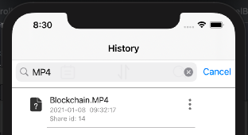

[toc]


# 分享历史 和 个人设置界面 报告

本次我主要完成的是传输历史和个人设置两个界面。接下来我对这两个界面进行一定的说明。

## 1 分享历史界面部分

这个界面的主要是用于显示分享的历史记录，以 tableView 的方式进行展示，除此以外在界面的最上方有三个功能，分别是：

* 通过一个日历选择日期，显示相应日期的分享条目
* 用于搜索的搜索框，通过文件名进行搜索
* 排序按钮，根据时间顺序，可以最早的先显示，也可以最晚的先显示

最终效果如图所示：


首先为了在 tableView 中显示分享的记录，先设置了自定义的cell

### 1.1 分享条目的自定义cell：TransferHistoryCell

#### 1.1.1 声明变量和UI组件

一些存数据的变量，包括：

* 长宽
* 文件名，大小，时间，id号，日期，图片icon

声明了一个初始化的方法

```objective-c
// page data
@property CGFloat height;
@property CGFloat width;
@property NSInteger style; // 0-comment 1-image


// file data
@property (nonatomic, strong)NSString *file_name;
@property (nonatomic, strong)NSString *file_size;
@property (nonatomic, strong)NSString *file_time;
@property (nonatomic, strong)NSString *file_id;
@property (nonatomic, strong)NSData *file_data;
@property (nonatomic, strong)UIImage *file_icon;
//@property long long file_id;

- (void)loadWithName:(NSString *)name WithData:(NSData *)data;
- (void)loadWithName:(NSString *)name WithId:(NSString *)fileID WithTime:(NSString *)time;
- (void)test:(NSInteger)type;
- (void)setOperationsTarget:(id)target WithSelector:(SEL)method;
```

一些UI组件用于这个cell的UI设置：

```objective-c
@property (nonatomic, strong)UILabel *name;
@property (nonatomic, strong)UILabel *size_date;
@property (nonatomic, strong)UILabel *label_share_id;
@property (nonatomic, strong)UIButton *operation;
@property (nonatomic, strong)UIImageView *icon;
@property (nonatomic, strong)UIProgressView *downloadProgressView; // 进度条
```

这里的 id 和 SEL 用于调用父类的方法：

```objective-c
@property (nonatomic, strong)id target;
@property SEL method;
```

#### 1.1.2 初始化函数

```objective-c
- (void)loadWithName:(NSString *)name WithId:(NSString *)fileID WithTime:(NSString *)time
{
    NSLog(@"here");
    
    self.height = 70;
    _width = self.frame.size.width;
    _style = 0;
    
    _file_name = name;
    NSRange range = NSMakeRange(10,1);
    _file_time = [time stringByReplacingCharactersInRange:range withString:@"  "];
    _file_id = fileID;
    
    [self loadName];
    [self loadIcon];
    [self loadOperation];
    [self loadSizeAndDate];
    [self loadShareId];
    [self loadLine];
}
```

进行相应的初始化

#### 1.1.3 加载UI组件

在相应的位置加载：

* 文件名
* 文件大小和分享的时间
* 文件的分享ID，即类似于百度云的邀请码
* cell最后的三个点，即Operation，点击后会有重命名，移动，删除等等功能，这里点击对应的函数是执行一个父类的函数
* 图片，可以根据文件的后缀名加载相应类型文件的图标
* 最下面的分割线

具体代码如下：

```objective-c
- (void) loadName
{
    if (_name == nil) {
        _name = [[UILabel alloc] initWithFrame:CGRectMake(50, 7, _width-80, 20)];
        [_name setTextAlignment:NSTextAlignmentLeft];
        _name.font = [UIFont systemFontOfSize:15];
        _name.textColor = UIColor.blackColor;
        
        [self addSubview:_name];
    }
    _name.text = _file_name;
}

- (void) loadSizeAndDate
{
    if (_size_date == nil) {
        _size_date = [[UILabel alloc] initWithFrame:CGRectMake(50, 28, _width-80, 15)];
        [_size_date setTextAlignment:NSTextAlignmentLeft];
        _size_date.font = [UIFont systemFontOfSize:12];
        _size_date.textColor = UIColor.grayColor;
        
        [self addSubview:_size_date];
    }
    _size_date.text = [[NSString alloc] initWithFormat:@"%@",_file_time];
}

- (void) loadShareId
{
    if(_label_share_id == nil){
        _label_share_id = [[UILabel alloc] initWithFrame:CGRectMake(50, 44, _width - 80, 15)];
        [_label_share_id setTextAlignment:NSTextAlignmentLeft];
        _label_share_id.font = [UIFont systemFontOfSize:12];
        _label_share_id.textColor = UIColor.grayColor;
        
        [self addSubview:_label_share_id];
    }
    _label_share_id.text = [[NSString alloc] initWithFormat:@"Share id: %@", _file_id];
}

- (void) loadOperation
{
    if (_operation == nil) {
        _operation = [[UIButton alloc] initWithFrame:CGRectMake(self.frame.size.width-20, 15, 20, 20)];
        _operation.contentMode = UIViewContentModeScaleAspectFit;
        
        [_operation setBackgroundImage:[UIImage imageNamed:@"operation.png"] forState:UIControlStateNormal];
        [_operation addTarget:self action:@selector(selectOperations) forControlEvents:UIControlEventTouchUpInside];
        
        [self.contentView addSubview:_operation];
    }
}

- (void) loadIcon
{
    if (_icon == nil) {
        _icon = [[UIImageView alloc] initWithFrame:CGRectMake(10, 10, 30, 30)];
        _icon.contentMode = UIViewContentModeScaleAspectFit;
        
        [self addSubview:_icon];
    }
    
    if ([_file_name hasSuffix:@"png"] || [_file_name hasSuffix:@"jpg"] || [_file_name hasSuffix:@"bmp"]){
        _file_icon = [UIImage imageWithData:_file_data];
        _style = 1;
    } else if ([_file_name hasSuffix:@"pdf"]) {
        _file_icon = [UIImage imageNamed:@"pdf.png"];
    } else if ([_file_name hasSuffix:@"doc"] || [_file_name hasSuffix:@"docx"]) {
        _file_icon = [UIImage imageNamed:@"doc.png"];
    } else if ([_file_name hasSuffix:@"txt"]) {
        _file_icon = [UIImage imageNamed:@"txt.png"];
    } else if ([_file_name hasSuffix:@"ppt"] || [_file_name hasSuffix:@"pptx"]) {
        _file_icon = [UIImage imageNamed:@"ppt.png"];
    } else if ([_file_name hasSuffix:@"xls"] || [_file_name hasSuffix:@"xlsx"]) {
        _file_icon = [UIImage imageNamed:@"xls.png"];
    } else if ([_file_name hasSuffix:@"zip"] || [_file_name hasSuffix:@"tar"]) {
        _file_icon = [UIImage imageNamed:@"zip.png"];
    } else {
        _file_icon = [UIImage imageNamed:@"other.png"];
    }
    
    _icon.image = _file_icon;
}
- (void)loadLine
{
    // line len
    CGFloat len = 45;
    UILabel *line = [[UILabel alloc] initWithFrame:CGRectMake(len, _height-3, _width-len, 1)];
    line.layer.borderColor = UIColor.grayColor.CGColor;
    line.layer.borderWidth = 0.5;
    
    [self addSubview:line];
}
```

这里点击cell最后的三个点后，触发的函数的内容是调用父类的相关函数，即调用分享界面 TransferHistoryPage 的相关函数：

```objective-c
- (void)selectOperations
{
    NSLog(@"select operations");
    // 调用父类的函数
    [_target performSelector:_method withObject:self afterDelay:0];
}
```

#### 1.1.4 效果

cell 如图所示：


后面三个点点击后的显示效果为：


### 1.2 分享历史界面 TransferHistoryPage

在这个页面中，我们来具体定义显示分享条目的 tableView 和三个附加的功能

#### 1.2.1 声明变量和UI组件

```objective-c
@property (nonatomic, strong)UILabel *upBar; // 顶部面板

@property (nonatomic, strong)UIProgressView *store; // 进度条

@property (nonatomic, strong)UITableView *tableView;    // 列表 tableView

@property (nonatomic, strong) UISearchBar *search; // 搜索栏

@property (nonatomic, strong) UIDatePicker *datePicker;// 选择日期

// Data
@property (nonatomic, strong)NSMutableArray<TransferHistoryCell *> *cells;

// 发生某些操作后要显示的数据的索引
@property (nonatomic, strong) NSMutableArray<NSNumber *> *showList;

// 标志着发生操作后显示 showList 中记录的索引的数据
@property NSInteger isOperated;

// 控制排序的顺序
@property NSInteger isAscending;

// location
@property CGFloat width;
@property CGFloat height;
```

#### 1.2.2 加载UI组件

加载UI组件的函数，要加载的UI组件包括：

* 顶部面板
* 三个实现附加功能的按钮

```objective-c
- (void)loadUpBar
{
    if (_upBar == nil) {
        _upBar = [[UILabel alloc] initWithFrame:CGRectMake(-1, 80, _width+2, 60)];
        
        _upBar.backgroundColor = UIColor.whiteColor;
        _upBar.layer.borderWidth = 1;
        _upBar.layer.borderColor = UIColor.grayColor.CGColor;
        //_upBar.layer.borderColor = UIColor.blackColor.CGColor;
        _upBar.layer.cornerRadius = 10;
    }
    
    [self.view addSubview:_upBar];
}

- (void)loadBtns
{
    int num = 4;
    CGFloat size = 30;
    
    UIButton *btn1 = [UIButton buttonWithType:UIButtonTypeRoundedRect];
    [btn1 setBackgroundImage:[UIImage imageNamed:@"riqi.png"] forState:UIControlStateNormal];
    btn1.frame = CGRectMake(self.view.frame.size.width/num - size/2, _upBar.frame.origin.y + 15, size, size);
    [btn1 addTarget:self action:@selector(ChangeDate:) forControlEvents:UIControlEventTouchUpInside];
    
    UIButton *btn2 = [UIButton buttonWithType:UIButtonTypeRoundedRect];
    [btn2 setBackgroundImage:[UIImage imageNamed:@"paixu.png"] forState:UIControlStateNormal];
    btn2.frame = CGRectMake(self.view.frame.size.width/num*2 - size/2, _upBar.frame.origin.y + 15, size, size);
    [btn2 addTarget:self action:@selector(SortCells:) forControlEvents:UIControlEventTouchUpInside];
    
    
    UIButton *btn3 = [UIButton buttonWithType:UIButtonTypeRoundedRect];
    [btn3 setBackgroundImage:[UIImage imageNamed:@"search.png"] forState:UIControlStateNormal];
    btn3.frame = CGRectMake(self.view.frame.size.width/num*3 - size/2, _upBar.frame.origin.y + 15, size, size);
    [btn3 addTarget:self action:@selector(loadSearchBar:) forControlEvents:UIControlEventTouchUpInside];
    
    
    
    [self.view addSubview:btn1];
    [self.view addSubview:btn2];
    [self.view addSubview:btn3];
}
```

效果如下：


#### 1.2.3 三个附加功能按钮对应的函数

##### 1.2.3.1 选择日期

通过日历选个日期后，对列表中的数据进行日期的比对，如果对得上就放入接下来要用来展示的 _showList 数组中。这里还用到了一个把日历中得到的日期结构变成我们存储的日期结构的函数 dataToEasyString，下面会有相应的说明。

```objective-c
//点击日期按钮后加载 datePicker 即日历
-(void)ChangeDate:(id)send{
    NSLog(@"change date is clicked");
    self.datePicker = [[UIDatePicker alloc]initWithFrame:CGRectMake(0, 100, _width+2, 90)];
    self.datePicker.datePickerMode = UIDatePickerModeDate;
    self.datePicker.locale = [[NSLocale alloc] initWithLocaleIdentifier:@"zh_CN"];
    [self.datePicker addTarget:self action:@selector(datePickerEnd:) forControlEvents:UIControlEventValueChanged];
    [self.view addSubview:self.datePicker];
    self.datePicker.hidden = NO;
}

//选个日期完成后进行相应的处理
-(void)datePickerEnd:(id)send{
    NSLog(@"datePickerEnd is clicked");
    NSString * temp = [self dataToEasyString:self.datePicker.date];
    
    [_showList removeAllObjects];
    _isOperated = 1;

    for(int i = 0; i < _cells.count; i ++) {
        if([_cells[i].file_time isEqualToString:temp]){
            [_showList addObject:[[NSNumber alloc] initWithInt:i]];
        }
    }
    
    [self.tableView reloadData];
    
    self.datePicker.hidden = YES;
}
```

日期字符串转换的函数：

这个函数的逻辑非常简单即取从日历得到的字符串的前十位，因为前十个刚好是日期，如 2021-01-17，这样就可以和我们存储的日期进行字符串比对了。

```objective-c
-(NSString *)dataToEasyString:(NSDate *)date{
    NSString * temp =[[NSString alloc] initWithFormat:@"%@", date];
    NSString * res = [[NSString alloc] initWithFormat:@"%@", [temp substringToIndex:10]];
    return res;
}
```

选日期的效果如下：


##### 1.2.3.2 排序

点击排序按钮后，这里的排序会对要显示的数据按日期进行排序，具体的实现没有使用已有的方法，而是自己写了一个OC版的冒泡排序，根据isAscending这个变量的情况决定是升序还是降序，每次点击会以不同的顺序进行排序，排序后刷新 tableView 进行重新的显示即可。

代码如下：

```objective-c
-(void)SortCells:(id)send{
    NSLog(@"SortCells is clicked");
    
    if(_isAscending == 1){
        _isAscending = 0;
        for (int i = 0; i < [_cells count] - 1; i++) {
            for (int j = 0; j < [_cells count] - i - 1; j++) {
              if (NSOrderedAscending == [[_cells objectAtIndex:j].file_time compare:[_cells objectAtIndex:j + 1].file_time]) {
                [_cells exchangeObjectAtIndex:j withObjectAtIndex:j + 1];
              }
            }
        }
    }else{
        _isAscending = 1;
        for (int i = 0; i < [_cells count] - 1; i++) {
            for (int j = 0; j < [_cells count] - i - 1; j++) {
              if (NSOrderedDescending == [[_cells objectAtIndex:j].file_time compare:[_cells objectAtIndex:j + 1].file_time]) {
                [_cells exchangeObjectAtIndex:j withObjectAtIndex:j + 1];
              }
            }
        }
    }
    
    [self.tableView reloadData];
}
```

##### 1.2.3.3 搜索

点击搜索按钮后，首先加载搜索框

```objective-c
- (void)loadSearchBar:(id) sender {
    _search = [[UISearchBar alloc] initWithFrame:CGRectMake(-1, 80, _width+2, 60)];
    
    _search.layer.borderColor = [UIColor.grayColor CGColor];
    _search.layer.borderWidth = 1;
    _search.placeholder = @" 搜索框";
    _search.showsBookmarkButton = NO;
    _search.delegate = self;
    [_search setShowsCancelButton:YES animated:YES];
    [self.view addSubview:_search];
    self.search.hidden = NO;
}
```

点击会车（即确认）进行搜索时，进行搜索的相关操作，具体逻辑是，检查分享条目的文件名字符串中是否包含搜索框中输入的内容，如果包含，即为搜索到，可以显示，如果不包含，即为搜索不到，不显示。

```objective-c
- (void)searchBarSearchButtonClicked:(UISearchBar *)searchBar
{
    NSLog(@"SearchButton %@", searchBar.text);
    [self searchShow:searchBar.text];
}
-(void)searchShow:(NSString *)str
{
    if([str isEqual:[[NSString alloc] initWithFormat:@""]]){
        NSLog(@"str is empty");
        _isOperated = 0;
        [self.tableView reloadData];
        return;
    }
    [_showList removeAllObjects];
    _isOperated = 1;

    for(int i = 0; i < _cells.count; i ++) {
        if([_cells[i].file_name containsString:str]){
            NSLog(@"%@", str);
            NSLog(@"%@", _cells[i].file_name);
            [_showList addObject:[[NSNumber alloc] initWithInt:i]];
            NSLog(@"%lu", (unsigned long)_showList.count);
        }
    }
    
    [self.tableView reloadData];
}
```

点击搜索框中的取消时，停止的操作，初始化一些对应的变量，显示最开始的全部的分享记录。

```objective-c
- (void)searchBarCancelButtonClicked:(UISearchBar *)searchBar
{
    self.search.text = @"";
    [self searchShow:self.search.text];
    self.search.hidden = YES;
}
```

搜索框的效果如图所示：



#### 1.2.4 TableView 相关

首先进行在相应位置进行基本的 tableView 的加载：

```objective-c
- (void)loadTable
{
    if (_tableView == nil) {
        int x = 20;
        _tableView = [[UITableView alloc] initWithFrame:CGRectMake(x, _store.frame.origin.y, _width-2*x, _height - 200)];
        
        _tableView.dataSource = self;
        _tableView.delegate = self;
        _tableView.backgroundColor = UIColor.whiteColor;
        
        [_tableView setScrollEnabled:YES];
        [_tableView setBounces:YES];
        _tableView.separatorStyle = UITableViewCellSeparatorStyleNone;
        
        [self.view addSubview:_tableView];
    }
}
```

进行一些设置：

* 共有多少个分区，返回1
* 一个分区中有多少行
  * 如果是被操作过，便返回 _showList.count
  * 否则则返回所有分享条目的数量 _cells.count
* 每行的高度，根据是否被操作过，返回 showList数组 或 cells数组的相应cell的高度
* 返回具体的 UITableViewCell，如果被操作过，要根据 showlist 找，否则从 cells 中找

```objective-c
- (NSInteger)numberOfSectionsInTableView:(UITableView *)tableView {
    return 1; // 返回值是多少既有几个分区，一个分区
}

// 返回一个分区中有几行，如果被操作过，返回 showList 的长度，如果没有被操作过，返回 cells 的长度
- (NSInteger)tableView:(UITableView *)tableView numberOfRowsInSection:(NSInteger)section
{
    NSLog(@"numberOfRowsInSection");
    if(_isOperated == 1) return _showList.count;
    else return _cells.count;
}

// 返回每行的高度，如果被操作过要去根据 showlist 找
-(CGFloat)tableView:(UITableView *)tableView heightForRowAtIndexPath:(NSIndexPath *)indexPath
{
    if(_isOperated == 1) return _cells[[_showList[indexPath.row] integerValue]].height;
    else return _cells[indexPath.row].height;
}

// 返回具体的 UITableViewCell，如果被操作过，要根据 showlist 找
- (UITableViewCell *)tableView:(UITableView *)tableView cellForRowAtIndexPath:(NSIndexPath *)indexPath
{
    NSLog(@"cellForRowAtIndexPath");
    if(_isOperated == 1) return _cells[[_showList[indexPath.row] integerValue]];
    return _cells[indexPath.row];
}
```

最后效果如图所示：


#### 1.2.5 通过网络请求获取分享记录信息 -> 刷新界面

这里应用了 <AFNetworking/AFNetworking.h> 库，想后端服务器请求数据，直接通过 get 方法得到一个数组，这个数组即为分享记录的数组，对数组元素进行相应的解析，然后 TransferHistoryCell 类型的变量，记录到我们的 cells 数组中即可。

```objective-c
- (void) reFreshThisPage
{
    NSLog(@"Refresh this page");
    
    self.isOperated = 0;
    self.isAscending = 1;
    
    AFHTTPSessionManager *refreshPage = [[AFHTTPSessionManager alloc] init];
    refreshPage.responseSerializer = [AFJSONResponseSerializer serializer];
    refreshPage.requestSerializer = [AFHTTPRequestSerializer serializer];
    NSString *refreshPageUrl = @"http://222.200.161.218:8080/share";
    [refreshPage GET:refreshPageUrl parameters:nil headers:nil progress:^(NSProgress * _Nonnull downloadProgress) {
    } success:^(NSURLSessionDataTask * _Nonnull task, id  _Nullable responseObject) {
        NSLog(@"Http get share succeed!");
        
        NSUInteger k = [responseObject count];
        NSLog(@"%lu", (unsigned long)k);
        
        
        [self.cells removeAllObjects];
        [self.showList removeAllObjects];
        
        for(int i = 0; i < k; i++){
            NSLog(@"%@", [responseObject[i] valueForKey:@"name"]);
            TransferHistoryCell *fc = [[TransferHistoryCell alloc] init];
            [fc loadWithName:[responseObject[i] valueForKey:@"name"] WithId:[responseObject[i] valueForKey:@"id"] WithTime:[responseObject[i] valueForKey:@"createdAt"]];
            // 把自己作为对象和方法的selector一起传递过去
            [fc setOperationsTarget:self WithSelector:@selector(test:)];
            [self.cells addObject:fc];
        }
        
        [self.tableView reloadData];
        NSLog(@"Over!");
        
    } failure:^(NSURLSessionDataTask * _Nullable task, NSError * _Nonnull error) {
        NSLog(@"Http get share failed!");
    }];
}
```

不要忘记在 viewWillAppear 函数中进行页面的刷新。

```objective-c
- (void)viewWillAppear:(BOOL)animated
{
    [self reFreshThisPage];
}
```


## 2 个人设置界面部分

这里的部分基本是沿用了我们的期中项目的个人设置界面，具体的实现逻辑和遇到的这种问题在期中的报告中已有非常详细的说明。这里再展示一下运行的效果：


个人界面：


award即获得的奖项：


store存储空间 和 config字体的设置：


然后是登出：


## 3 个人总结和感悟及遇到的问题和解决办法

这次我主要做的事分享历史界面的工作，大体来说就是tableview的显示和附加的三个功能的实现。

首先说一下三个附加功能：

* 选择日期
  * 这里第一次接触到 datePicker 这种东西，开始时不太会用，后来也是慢慢懂了具体的逻辑，开始自己试着使用，即如何初始化日历，选中日期后启动的相关函数和相关的返回值的情况，然后再对存储数据和tableview进行一些操作，完成了对相应日期的分享条目的显示。
* 排序
  * 这里本来想用现成的方法对日期进行直接的排序，但是因为相关数据结构的一些特殊性质，没有现成的方法可以很好的实现我们想要的效果，于是只好自己手写了OC版冒泡排序，效率不能说是很好，但完全符合我们的需求。
* 搜索
  * 这里的进步就是，搜索只要搜到文件名中包含这个输入内容的就显示，而不是之前的暴力字符串匹配。
  * 还有一个细节就是，这里增加了一个 Cancel 按钮，按下这个按钮时，相当于对这个页面进行了一次刷新，显示的数据又变成了初始化时的样子。

这里除了基础的存所有的数据的数组 cells之外，还新加了一个 showList 数组，这个数组存储的是 cells 的索引，即要显示的数组在 cells中的索引，当进行了某些操作后，我们通过 showList 数组中存储的索引找到 cells 数组中的相关数据，进行显示。

tableview显示方面，因为有之前几次的经验，这次已经是比较的熟练，设置好自定义的cell的情况，然后进行相关的显示即可。

网络请求方面，之前虽然用过，但还是不太熟悉，这次我请求到的是一个数组，进行解析变成我们想要的数据结构也是花了一定功夫。

解决了网络请求的问题后，我刚开始并没有注意页面刷新的问题，导致我们在分享了新的内容，后端服务器数据也更新了之后这里并没有显示，后来我通过 viewWillAppear 函数进行了页面的刷新，当这个页面重新出现时，就会进行相应的刷新，而刷新时，则先删除之前的数据然后进行了新一次的网络请求。

个人设置界面，虽然期中作业中我们用的就是这个界面，但是从期中的社交项目把这个界面的内容迁移到这个项目却还是个比较费力的事，因为使用的后端不同，相关的很多设置也不同，代码量较大，文件数也较多，整合起来非常容易出现问题，因为一些细节的问题，就经常让两个项目整合到一起时便跑不起来了，仔细改相关代码，耐心整合后，整个项目终于成功的跑了起来。

总体来说，本次期末项目虽然开发过程对我们来说有些许的困难，但非常提高我们的工程能力，也加深了我们对一些组件设置和运行逻辑的理解，让我们对自己开发IOS项目更加的得心应手，收获很大！