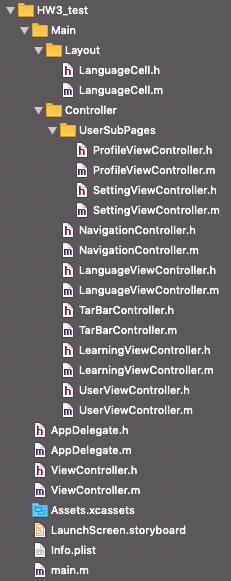

## UI组件的布局与使用、动画

###  开发环境

* Mac OS
* Objective-C
* Xcode

参考文件结构：




### 懒加载

懒加载(Load On Demand)是一种独特而又强大的数据获取方法，也会被称为延迟加载，能够达到用时再加载的效果；而且加载过以后就不会再次加载，这样就节约了系统资源。

懒加载的实现方法：

- 在类中添加一个property
- 重写该property的getter方法，判断对象是否为空，为空时再进行初始化

示例，添加一个UILabel：

```objective-c
@interface LanguageViewController ()
@property (nonatomic, strong) UILabel *titleLabel;  
@end  

@implementation LanguageViewController

- (void)viewDidLoad {
    [super viewDidLoad];
    [self.view addSubview: self.titleLabel];
}

- (UILabel *)titleLabel {
    if(_titleLabel == nil) {
        _titleLabel = [[UILabel alloc] initWithFrame:CGRectMake(0, _collectionView.frame.origin.y - 60, self.view.frame.size.width, 30)];
        [_titleLabel setText: @"请选择语言"];
        [_titleLabel setFont: [UIFont systemFontOfSize: 20]];
        [_titleLabel setTextColor: [UIColor blackColor]];
        [_titleLabel setTextAlignment:NSTextAlignmentCenter];
    }
    return _titleLabel;
}

@end
```


### UITableView

UITableView是一个列表控件，广泛运用于App的各个界面。其本质是垂直方向滚动的ScrollView。

使用UITableView时需要遵循数据源（UITableViewDataSource）和代理（UITableViewDelegate）两个协议，前者负责数据源提供何编辑相关改变，后者负责布局和交互行为。

#### UITableViewCell的重用

为了做到显示和数据分离，tableView并不为每个数据项创建一个tableCell。而是只创建屏幕可显示最大个数的cell。然后重复使用这些cell，对cell做单独的显示配置，来到节约内存和提高加载速度的目的。创建cell的时候会保存到可见cell数组。当滚动时，滚出屏幕外的cell会从可见cell移除，插入到重用cells中去。滚入屏幕的cell会触发加载过程。优先从重用cell中获取，如果获取不到则会创建新的cell，并设置到可见cell中去。

```objective-c
#pragma mark UITableViewDataSource

- (NSInteger)numberOfSectionsInTableView:(UITableView *)tableView;

- (NSInteger)tableView:(UITableView *)tableView numberOfRowsInSection:(NSInteger)section;

- (NSString *)tableView:(UITableView *)tableView titleForHeaderInSection:(NSInteger)section;

- (UITableViewCell *)tableView:(UITableView *)tableView cellForRowAtIndexPath:(NSIndexPath *)indexPath;

#pragma mark UITableViewDelegate
- (void)tableView:(UITableView *)tableView didSelectRowAtIndexPath:(NSIndexPath *)indexPath;

- (CGFloat)tableView:(UITableView *)tableView heightForRowAtIndexPath:(NSIndexPath *)indexPath;

- (CGFloat)tableView:(UITableView *)tableView heightForHeaderInSection:(NSInteger)section;
```


### UICollectionView

UICollectionview控件也是开发中经常使用到的一个控件，相比于UITableview，UICollectionview是iOS6之后引入的一个新的UI控件，它和UITableview有着许多的相似之处，但是它是一个比UITableView更加强大的一个视图控件，使用过程中也需要实现数据源以及代理方法，此外还需要实现layout布局回调的代理方法（UICollectionViewDelegateFlowLayout）。

可以通过继承`UICollectionViewCell`类来实现自定义的Cell：

```objective-c
@interface LanguageCell : UICollectionViewCell
@property (strong, nonatomic) UIImageView *image;
@property (strong, nonatomic) UILabel *title;
@end
```

CollectionView在完成代理回调前，必须对Cell进行注册：

```objective-c
// 设置代理
_collectionView.delegate = self;
_collectionView.dataSource = self;
// 注册cell
[_collectionView registerClass:[LanguageCell class] forCellWithReuseIdentifier:@"MyCell"];
```

一般需要实现的代理方法：

```objective-c
#pragma mark - UICollectionViewDelegateFlowLayout

// 返回Header的尺寸大小
- (CGSize)collectionView:(UICollectionView *)collectionView layout:(UICollectionViewLayout*)collectionViewLayout referenceSizeForHeaderInSection:(NSInteger)section；
// 返回cell的尺寸大小
-(CGSize)collectionView:(UICollectionView *)collectionView layout:(UICollectionViewLayout *)collectionViewLayout sizeForItemAtIndexPath:(NSIndexPath *)indexPath；
// 返回Footer的尺寸大小
- (CGSize)collectionView:(UICollectionView *)collectionView layout:(UICollectionViewLayout*)collectionViewLayout referenceSizeForFooterInSection:(NSInteger)section；
// 返回cell之间行间隙
- (CGFloat)collectionView:(UICollectionView *)collectionView layout:(UICollectionViewLayout*)collectionViewLayout minimumLineSpacingForSectionAtIndex:(NSInteger)section；
// 返回cell之间列间隙
- (CGFloat)collectionView:(UICollectionView *)collectionView layout:(UICollectionViewLayout*)collectionViewLayout minimumInteritemSpacingForSectionAtIndex:(NSInteger)section；

#pragma mark - UICollectionViewDataSource

// 返回Section个数
- (NSInteger)numberOfSectionsInCollectionView:(UICollectionView *)collectionView；
// 返回cell个数
- (NSInteger)collectionView:(UICollectionView *)collectionView numberOfItemsInSection:(NSInteger)section；
// 返回cell内容
- (UICollectionViewCell *)collectionView:(UICollectionView *)collectionView cellForItemAtIndexPath:(NSIndexPath *)indexPath；
  
#pragma mark - UICollectionViewDelegate 

// 点击选中事件
- (void)collectionView:(UICollectionView *)collectionView didSelectItemAtIndexPath:(NSIndexPath *)indexPath；  
```


### UINavigationController

UINavigationController是一个容器类，对ViewController进行栈管理，可以用于进行页面间的跳转。

UINavigationController包含了NavigaitonBar，即导航栏，主要对UINavigationItem进行栈管理，展示导航栏的外观背景。

UINavigationController为每个UIViewController生成一个UINavigationItem，通过这个UINavigationItem可以改变NavigaitonBar上的按钮和标题等元素。

使用时可以通过initWithRootViewController方法进行初始化，同时将根页面的ViewController压入栈中。利用压栈和出栈方法来进行页面间的导航。


### UITabBarController

UITabBarController和UINavigationController相似，也继承于UIViewController，管理多个控制器，完成控制器之间的切换。

UITabBarController 包含 UITabBar，而UITabBar又包含 UITabBarItem。每个UITabBarItem都关联一个ViewController。

通过初始化方法可以设置UITabBarItem的`title`, `image`, `selectedImage`等显示元素。


### 基于UIView Animation的帧动画

基础动画只能将 UIView的属性从一个值变化到另一个值，而关键帧动画可以包含任意一个关键帧，使 UIView在多个值之间进行变化。关键帧动画可以看成是若干个连续执行的基础动画。

`addKeyframeWithRelativeStartTime:relativeDuration:animations:`方法用于添加关键帧，其中`relativeStartTime`参数相对起始时间，表示该关键帧开始执行的时刻在整个动画持续时间中的百分比。`relativeDuration`参数为相对持续时间，表示该关键帧占整个动画持续时间的百分比。两个参数均为浮点数类型，取值范围为0至1.

```objective-c
[UIView animateKeyframesWithDuration:0.5 delay:0.5 options:UIViewKeyframeAnimationOptionCalculationModeLinear animations:^{
	[UIView addKeyframeWithRelativeStartTime:0 relativeDuration:0.6 animations: ^{
		// key frame 0
	}];
	[UIView addKeyframeWithRelativeStartTime:0.6 relativeDuration:0.4 animations: ^{
		// key frame 1
	}];
} completion:^(BOOL finished) {
            
}];

### iOS调用系统相机拍照和从相册选取照片
https://www.jianshu.com/p/13bfabdb5caa